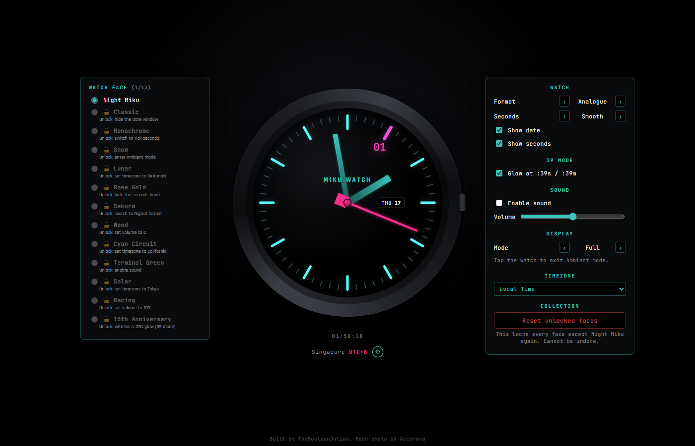
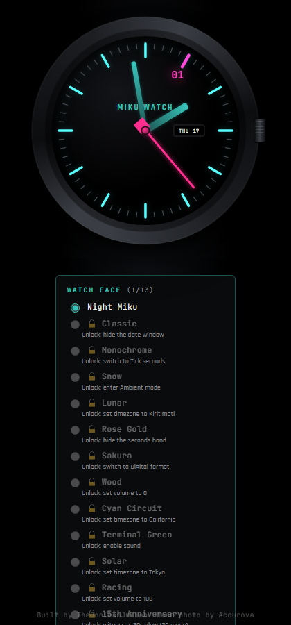
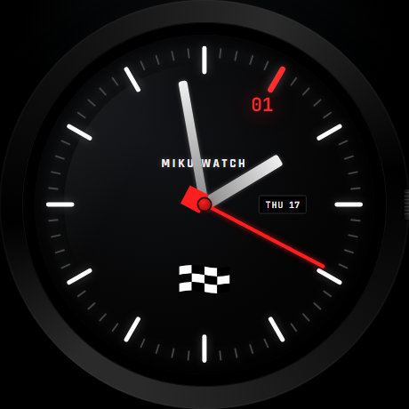
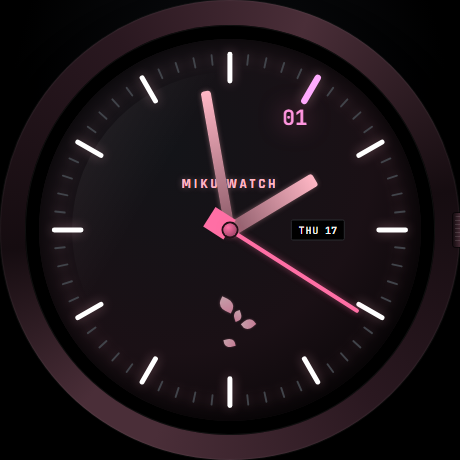
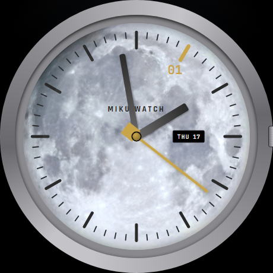
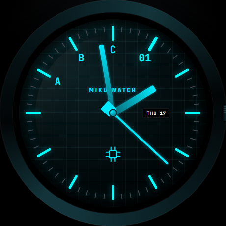
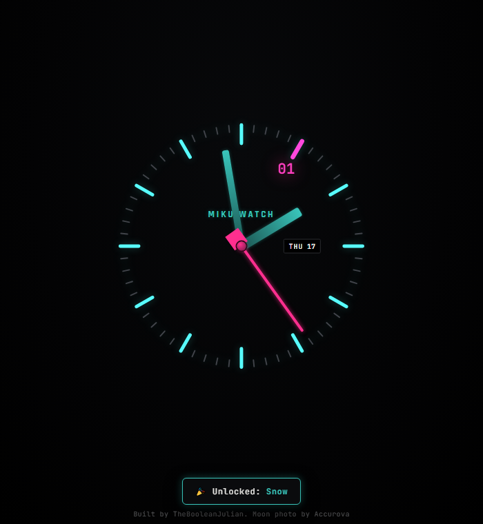

# Miku Watch

A single-file, dependency-free analog watch face in the browser — a Seiko-inspired
teal-and-magenta dial built as an anniversary piece, with a growing set of
mechanical realism, personalization, and a collectible watch-face system layered
on top.

**Current version: 0.14.0** — see [CHANGELOG.md](CHANGELOG.md) for the full
version history.

## Screenshots

**Desktop** — the watch face gallery and settings panel open on either side,
never shifting the watch itself off-center:



**Mobile** — everything stacks in normal document flow, with the face gallery
showing lock state and unlock hints for faces you haven't earned yet:



**A few of the thirteen watch faces:**

| Racing | Sakura | Lunar | Cyan Circuit |
|:---:|:---:|:---:|:---:|
|  |  |  |  |

**Ambient mode** — chrome stripped down to just the glowing hands (the toast
here shows the unlock system in action — entering Ambient just unlocked Snow):



## Getting Started

No build step, no framework, no external libraries: it's one `index.html`
with inline CSS and vanilla JS, plus a single image asset (the Lunar face's
moon photo) in `assets/`.

```
git clone https://github.com/TheBooleanJulian/miku-watch.git
cd miku-watch
```

Then just open `index.html` in a browser — no server, no install step.

## Features

### Watch face collection

Faces appear in a permanent, deliberate order (signature → neutral/white →
warm/natural → tech → bold → special-edition), not alphabetically or by
unlock order:

| Face | Look | Unlock condition |
|---|---|---|
| **Night Miku** | Chrome-free teal/magenta signature look | Unlocked from the start |
| **Classic** | White case/dial, black hands, red second hand | Hide the date window |
| **Monochrome** | Conventional silver case, no color gimmick | Switch to Tick seconds |
| **Snow** | White case/dial, light-blue accent, snowflake icon | Enter Ambient mode |
| **Lunar** | Real full-moon photo as the dial, gold accent | Set timezone to Kiritimati |
| **Rose Gold** | Warm rose-gold case and hands on a dark dial | Hide the seconds hand |
| **Sakura** | Cherry-blossom pink with scattered petal decorations | Switch to Digital format |
| **Wood** | Warm wood-grain case and dial, no glow | Set volume to 0 |
| **Cyan Circuit** | All-cyan circuit-trace dial, hex hour numerals (A/B/C), microchip icon | Set timezone to California |
| **Terminal Green** | Phosphor-green monochrome, white second hand | Enable sound |
| **Solar** | Silicon-photovoltaic-cell grid dial, blue + amber, sun icon | Set timezone to Tokyo |
| **Racing** | Black case, white hands, red accents, checkered-flag icon | Set volume to 100 |
| **15th Anniversary** | Warm gold accent, "15" marker on the 3 o'clock tick | Witness a `:39` second glow (39 mode) |

Every face is one set of CSS custom-property overrides, so hands, ticks, the
case, and the hub all retheme automatically — no per-element styling needed
per face (the 39-mode glow and hex numerals read the same variables, so they
match too). The face picker shows a live "(x/13) unlocked" count, locks out
radios for faces you haven't earned yet (with a hint on how to unlock them),
and pops a toast the moment you unlock a new one. A "Reset unlocked faces"
button (Settings → Collection) re-locks everything except Night Miku, with a
confirmation dialog, if you want to start the collection over.

The whole app is always true-black (OLED) with permanently luminous ticks and
numerals — there's no light/dark toggle, this is the one look.

### Analogue / Digital

A left/right toggle in Settings, independent of the watch face: Digital swaps
the hands and ticks for a big digital readout, but keeps whichever face's
colors are active (same CSS custom properties), so it always matches the
current theme rather than having its own fixed look.

### Mechanical realism

- Smooth sweeping second hand (or switch to a discrete per-second "tick").
- Soft directional shadows cast by the hands onto the dial.
- A draggable, clickable crown: drag left/right to cycle timezones, click/tap
  to open the timezone picker directly.
- Changing timezone spins the hour and minute hands forward (clockwise only,
  never backward) at a fixed rate of 2 clock-hours per second of real time —
  the second hand keeps ticking live throughout, with no rollover glitches.
- All three hands share a single, exact rotation axle.

### Personalization

- **Watch face** — a standalone gallery box (see Layout below) holding the
  thirteen-face collection. Its open/closed state is tied to the settings
  panel's — the gear icon opens and closes both together.
- **Settings panel (gear icon)** — everything else:
  - **Watch** — Format (Analogue/Digital) and Seconds (Smooth/Tick) as
    left/right button toggles, plus show/hide date and seconds checkboxes.
  - **39 mode** — the second hand glows at `:39` seconds, and the minute
    hand briefly glows during the `:39` minute.
  - **Sound** — an enable checkbox plus a 0–100 volume slider controlling
    every synthesized tone's gain.
  - **Display** — Full/Ambient as a left/right button toggle.
  - **Timezone** — ~65 cities grouped into `<optgroup>`s by current UTC
    offset, plus Local Time and UTC pinned at the top.
  - **Collection** — the reset-unlocks button described above.

All settings persist across reloads via `localStorage`.

### Ambient mode

Strips away the crown, bezel ring, glass reflection, and case/dial
backgrounds, leaving just the glowing ticks and hands on a dark page — a
minimalist, distraction-free clock. Tap/click the watch to exit back to Full
mode (Escape also works).

### Sound

Fully synthesized with the Web Audio API — no audio files. A mechanical tick
on each second, a crown detent click while dragging, a settings-button
click, and a three-note startup chime, all scaled by the volume slider. Off
by default; enabling it respects browser autoplay policy by only starting
audio on a real user gesture.

### Layout

Centered on the page at any size. On wide viewports (≥1180px) the watch face
gallery sits in its own persistent box to the *left* of the watch, and the
settings panel opens to its *right* — neither shifts the watch from center.
On narrower viewports both stack in normal document flow (face gallery above
the caption, settings panel collapsible as usual), and the page scrolls
vertically whenever that stacked content is taller than the screen.

### Touch gestures

- Swipe left/right on the watch to switch between unlocked faces.
- Swipe up to open the settings panel.
- Drag a single finger to tilt the watch in 3D for a quick "inspect" look —
  it springs back to flat on release.
- Pinch with two fingers to zoom the watch (0.85x–1.8x).
- Double-tap to enter Ambient mode; a single tap while in Ambient exits back
  to Full.
- Tap the timezone readout to open the timezone picker (same as tapping the
  crown).

## Changelog

See [CHANGELOG.md](CHANGELOG.md) for the full, version-by-version history —
every feature added, changed, removed, or fixed, from the initial release
through the current version.

## Roadmap

Rough, unordered ideas for future versions — none are committed, and the
project may go in a different direction entirely:

- **More watch faces.** The 13-face collection has room to grow; the
  ordering scheme (signature → neutral → warm → tech → bold → special
  edition) already has slots for new categories.
- **Complications.** A small sub-dial or readout for things like date,
  day-of-week, or a second timezone, gated behind its own unlock condition.
- **Face import/export.** Serialize unlock state (and maybe custom faces)
  to a shareable code or file, so progress isn't stuck to one browser's
  `localStorage`.
- **PWA support.** A manifest + service worker so the watch can be
  installed and used offline, fitting the single-file/no-backend spirit.
- **Custom face editor.** Expose the CSS custom-property theme system
  (already the mechanism every face uses) as an in-app color picker for
  building your own face.
- **Alarms/timers.** Lightweight additions that fit a watch metaphor
  without needing a backend.
- **Accessibility pass.** Keyboard navigation for the crown/timezone
  picker and face gallery, plus a reduced-motion mode for the hand
  animations and glow effects.
- **Automated tests.** Currently untested by design (no build step); a
  lightweight visual/interaction test harness could catch regressions in
  hand rotation math and unlock logic as the face count grows.

Ideas and PRs welcome via GitHub issues.

## Tech

Plain HTML + CSS + JavaScript. No dependencies, no bundler, no external
libraries. Uses the `Intl.DateTimeFormat` API (backed by the IANA time zone
database via the browser's ICU implementation) for timezone-aware time
formatting — including historical and scheduled DST rules — rather than any
hardcoded date logic.

## Credits

Built by TheBooleanJulian. Moon photo (Lunar face) by Accurova. Both are
credited in a small footer on the page itself.
